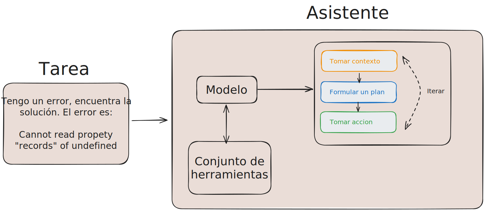

## ¿Qué es Claude Code?

Claude Code es la CLI oficial de Anthropic para interactuar con Claude directamente desde la terminal. A diferencia de los chatbots convencionales, Claude Code opera como un **agente autónomo** capaz de leer, escribir y ejecutar código en tu entorno local.

## El loop agéntico

Claude Code sigue un ciclo de razonamiento-acción conocido como loop agéntico:

1. **Percibir** — Lee el contexto: archivos, resultados de comandos, mensajes del usuario.
2. **Razonar** — Planifica la siguiente acción más adecuada.
3. **Actuar** — Ejecuta una herramienta (leer archivo, editar, correr tests, etc.).
4. **Observar** — Recibe el resultado y decide si continuar o detenerse.

# Claude vs Claude Code
Vamos a hacer primero la diferenciacion entre lo que es Claude y lo que es Claude Code, al usar claude.
Algo clave para entender como usar Claude Code es entender que no es un chatbot, este se apoya usando los modelos LLLM de Anthropic, como Claude, pero no es un chatbot, es una herramienta que se ejecuta en tu terminal y tiene acceso a tu sistema de archivos, a tu terminal, a la web, etc. 
Esto trae una serie de ventajas, pero tambien aspectos a tener en cuenta.

### Diferencias entre Asistente de Codigo y LLMs 
Un modelo de lenguaje, por su funcionamiento solo puede completar texto, esto hace que su uso sea limitado, ya que no puede interactuar con el entorno, no puede ejecutar codigo, no puede leer archivos, etc.
Los asistentes de codigos son los intermediarios entre los LLMs y el usuario, estos pueden ejecutar codigo, leer archivos, etc. Esto hace que su uso sea mucho mas poderoso, ya que pueden interactuar con el entorno y no solo completar texto.

## Herramientas nativas

Claude Code tiene acceso a un conjunto de herramientas integradas:

| Herramienta | Descripción |
|-------------|-------------|
| `Read` | Leer archivos del sistema |
| `Write` | Crear o sobrescribir archivos |
| `Edit` | Ediciones quirúrgicas con diff exacto |
| `Bash` | Ejecutar comandos de terminal |
| `Glob` | Buscar archivos por patrón |
| `Grep` | Buscar contenido dentro de archivos |
| `WebFetch` | Obtener contenido de URLs |
| `WebSearch` | Buscar en la web |
| `Agent` | Lanzar subagentes especializados |
| `TodoWrite` | Gestionar lista de tareas |
