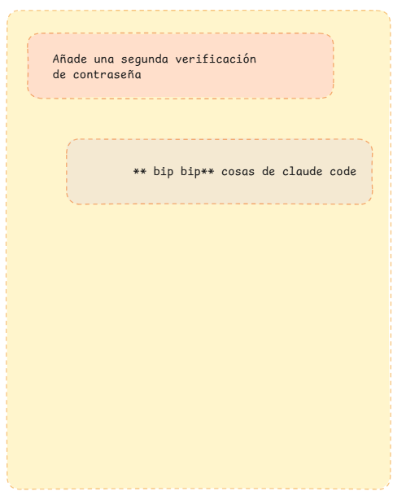
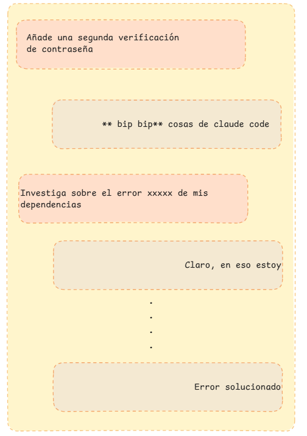

## Manipulacion de contexto y sesiones en Claude Code

Imagina que estas trabajando en una nueva feature para tu app, vamos a ponerle que es un sistema de login.
Tu conversación con Claude Code seria algo como:



En medio de la conversación, te das cuenta que ocurre un error con respecto a las dependencias, vas a pausar la convesación sobre  login y le preguntas a Claude sobre el error, algo asi:  



## Sesiones

Una sesión de Claude Code es una conversación continua con memoria del historial. Se inicia al ejecutar `claude` y termina al cerrar la terminal o con `/exit`.

:::caution
Las sesiones están atadas al **directorio**, no a la branch de git. Cambiar de branch dentro de la misma sesión mantiene el historial de conversación, pero Claude verá los archivos de la nueva branch.
:::

### Reanudar sesiones

```bash
claude --continue          # Continúa la última sesión del directorio actual
claude --resume            # Abre un selector
<!-- @import "[TOC]" {cmd="toc" depthFrom=1 depthTo=6 orderedList=false} -->
 de sesiones anteriores
claude --resume auth-fix   # Retoma una sesión por nombre
```

### Nombrar y bifurcar sesiones

Desde dentro de una sesión activa:

```bash
/rename auth-refactor                  # Nombrar la sesión actual
claude --continue --fork-session       # Bifurca la sesión (nuevo ID, mismo historial)
```

### Listar sesiones anteriores

```bash
claude --list-sessions
```

## Ventana de contexto

La ventana de contexto contiene: historial de conversación, archivos leídos, outputs de comandos, el `CLAUDE.md`, skills cargados e instrucciones del sistema. **Se llena rápido.**

El rendimiento de Claude degrada a medida que el contexto se llena. Instrucciones dadas al inicio pueden "perderse" cuando la ventana está casi llena.

:::tip
**Regla clave: Las instrucciones persistentes van en `CLAUDE.md`, no en el chat.**
:::

Claude compacta automáticamente cuando se acerca al límite: primero limpia outputs antiguos, luego resume la conversación.

### Gestión manual del contexto

```bash
/context               # Ver qué consume espacio
/compact               # Compactar el historial manualmente
/compact focus on X    # Compactar preservando un tema específico
/clear                 # Resetear el contexto completamente
```

## Git Worktrees

Los worktrees permiten trabajar en sesiones paralelas completamente aisladas, sin que interfieran entre sí:

```bash
claude --worktree feature-auth   # Crea worktree en .claude/worktrees/feature-auth/
claude --worktree bugfix-123     # Segunda sesión completamente aislada
```

También puedes crear un worktree manualmente:

```bash
git worktree add .claude/worktrees/mi-feature -b mi-feature
```

### Ventajas de los worktrees

- **Aislamiento**: los cambios no afectan tu rama de trabajo principal
- **Paralelismo**: múltiples tareas en simultáneo sin conflictos
- **Reversibilidad**: descartar cambios es tan simple como eliminar el worktree

### Limpieza automática

Si la sesión no generó cambios, el worktree y su branch se eliminan al salir. Si hay cambios, Claude pregunta si mantener o eliminar.

```bash
git worktree remove .claude/worktrees/mi-feature
git worktree prune
```

:::tip
Agrega `.claude/worktrees/` a tu `.gitignore`.
:::
